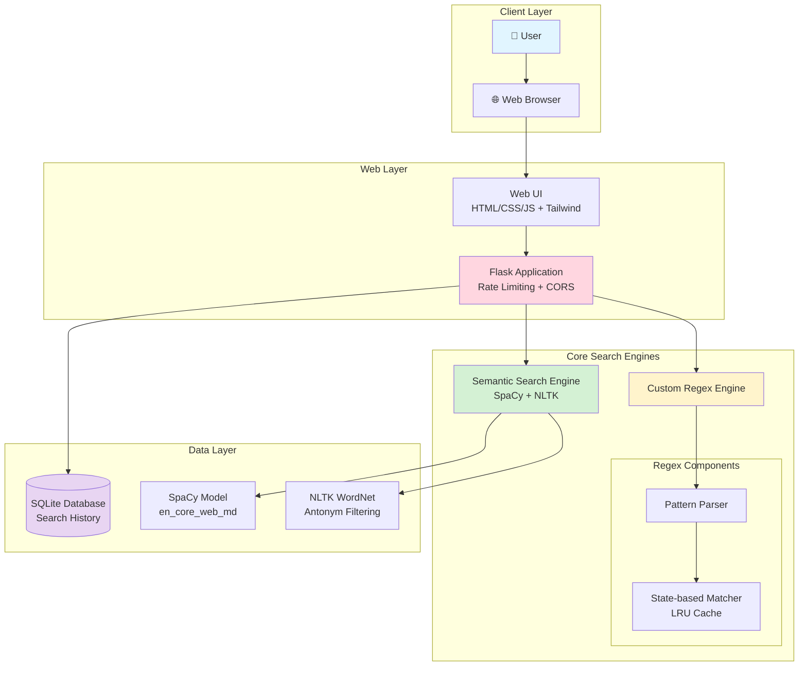

# 🔍 DeepGrep

> **Lightning-fast regex meets AI-powered semantic search**  
> Find exact patterns and contextually relevant matches with intelligent history tracking and REST API integration.

---

## 🛠️ Tech Stack

### Core Development & Language
[](https://www.python.org/)
[](https://docs.python.org/3/library/functools.html)
[](https://docs.python.org/3/library/dataclasses.html)

### Web Application Stack
[](https://flask.palletsprojects.com/)
[](https://flask-cors.readthedocs.io/en/latest/)
[](https://developer.mozilla.org/en-US/docs/Web/HTML)
[](https://developer.mozilla.org/en-US/docs/Web/JavaScript)
[](https://www.sqlite.org/index.html)

### Search Engines & NLP
[](https://github.com/alwaysvivek/DeepGrep)
[](https://spacy.io/)
[](https://spacy.io/models)
[](https://www.nltk.org/howto/wordnet.html)

### Quality & Tools
[](https://www.jetbrains.com/qodana/)
[](https://www.postman.com/)
 
### License
[](https://opensource.org/licenses/MIT)

---

## 📋 Table of Contents

- [Features](#-features)
- [2026 Tech Trends](#-2026-tech-trends)
- [Installation](#-installation)
- [Usage](#-usage)
- [API Endpoints](#-api-endpoints)
- [Configuration](#-configuration)
- [Contributing](#-contributing)
- [License](#-license)

---

## 🏗️ Architecture

DeepGrep follows a modular architecture with clear separation between the web layer, core search engines, and data persistence:



### Component Overview

- **Web UI**: Interactive interface with dual search modes (regex/semantic), built with Tailwind CSS
- **Flask Application**: REST API with rate limiting, CORS support, and comprehensive logging
- **Custom Regex Engine**: From-scratch implementation supporting complex patterns, quantifiers, and capture groups
- **Semantic Search Engine**: AI-powered similarity matching using word embeddings and POS filtering
- **Search History**: Persistent SQLite database tracking all searches with timestamps and analytics

---

## 🚀 Features

DeepGrep combines a high-performance custom regex engine with AI-powered semantic search, backed by persistent history tracking. Key features include:

### 🔍 Custom Regex Engine
- **Full Regex Support**: Implements a complete regex matcher from scratch, supporting literals, character classes (`\d`, `\w`, `[abc]`), quantifiers (`*`, `+`, `?`, `{n,m}`), alternations (`|`), anchors (`^`, `$`), capture groups, and backreferences.
- **Efficient Matching**: Uses state-based matching with caching for compiled patterns to ensure fast performance on large texts.
- **Line-by-Line Processing**: Optimized for searching through multi-line text inputs.

### 🧠 Semantic Search
- **AI-Powered Similarity**: Leverages SpaCy NLP models to find semantically related words based on vector similarity.
- **Antonym Avoidance**: Integrates WordNet to exclude antonyms and irrelevant matches.
- **POS Filtering**: Filters results by part-of-speech (e.g., adjectives, verbs) for more accurate contextual matches.
- **Configurable Thresholds**: Adjustable similarity thresholds and top-N results for fine-tuned searches.

### 📊 Search History & Analytics
- **Persistent Logging**: SQLite-backed database to log all searches with timestamps, match counts, and file sources.
- **History Queries**: Retrieve recent searches, top-used patterns, or export/import history to/from JSON.
- **Automatic Cleanup**: Maintains a maximum history size to prevent database bloat.

### 🌐 Web Interface & API
- **Flask Web App**: Simple HTML/CSS/JS frontend for interactive searches.
- **REST API**: Endpoints for regex and semantic searches, with JSON responses.
- **Rate Limiting**: Configurable request limits to prevent abuse.
- **CORS Support**: Cross-origin requests enabled for integration.
- **Logging**: Comprehensive logging for debugging and monitoring.

### 🐳 Containerization & Deployment
- **Docker Support**: Dockerfile for easy containerization and deployment.
- **Environment Configuration**: Uses `python-decouple` for secure, environment-based config (e.g., via `.env` files).
- **Production Ready**: Includes lazy initialization, error handling, and scalable architecture.

### 🧪 Testing & Quality
- **Unit Tests**: Test suite in the `tests/` directory for core functionality.
- **Code Quality**: Integrated with Qodana for static analysis.
- **API Testing**: Postman collections for endpoint validation.

---

## 📦 Installation

**Clone the repository**:
   ```bash
   git clone https://github.com/alwaysvivek/deepgrep.git
   cd deepgrep
   ```
   
**Install dependencies**

    pip install -r requirements.txt

### Download SpaCy model
    python -m spacy download en_core_web_md
    
### Set up environment (optional)
Copy `.env.example` to `.env` and configure as needed.

### Run the app
    python -m deepgrep.web.app

### Or using Docker

    docker build -t deepgrep .
    docker run -p 8000:8000 deepgrep

---

## 💡 Usage

### Web Interface

Open http://localhost:8000 in your browser.  
Enter text and patterns for regex search or keywords for semantic search.

### API Usage

Use tools like curl or Postman to interact with the API.

#### Regex Search

    curl -X POST http://localhost:8000/search \
      -H "Content-Type: application/json" \
      -d '{"pattern": "hello.*world", "text": "hello beautiful world"}'

#### Semantic Search

    curl -X POST http://localhost:8000/semantic \
      -H "Content-Type: application/json" \
      -d '{"keyword": "happy", "text": "I am joyful and content."}'

---

## 🔗 API Endpoints

### GET /

Serves the home page.

### POST /search

Performs regex search.

Request body:

    {
      "pattern": "string",
      "text": "string"
    }

Response:

    {
      "matches": [],
      "history": []
    }

### POST /semantic

Performs semantic search.

Request body:

    {
      "keyword": "string",
      "text": "string"
    }

Response:

    {
      "matches": [["word", score]]
    }

---

## ⚙️ Configuration

Configure via environment variables (or `.env` file):

    PORT=8000
    DEBUG=True
    HOST=0.0.0.0

    RATE_LIMIT_ENABLED=True
    RATE_LIMIT_REQUESTS=100

    DB_PATH=~/.grepify_history.db
    MAX_HISTORY=200

    SPACY_MODEL=en_core_web_md
    SEMANTIC_THRESHOLD=0.45
    SEMANTIC_TOP_N=10

---

## 🤝 Contributing

Contributions are welcome!

- Fork the repo
- Create a feature branch
- Add tests for new features
- Ensure code passes Qodana checks
- Submit a pull request

---

## 📄 License

This project is licensed under the MIT License.  
See the LICENSE file for details.
